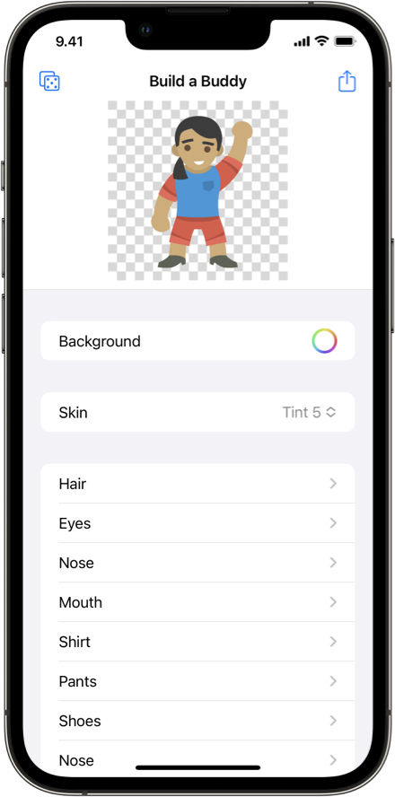

# 👋 BuildABuddyKit

A framework for building customized characters and exporting them to images.

### 📚 Learning Material

The framework is meant for learning purposes and will serve as an example Swift package for the learning material presented at FrenchKit 2022.

The learning material that guides the read through documenting BuildABuddyKit is available at [docc-lm.simonbs.dev/tutorials/table-of-contents](https://docc-lm.simonbs.dev/tutorials/table-of-contents)

### 📖 Documentation

The documentation of BuildABuddyKit is made with Apple's [DocC](https://developer.apple.com/documentation/docc) framework. The documentation can be built by opening the BuildABuddyKit package in Xcode and selecting Product > Build Documentation.

### 📱 Example App

The BuildABuddy app in this repository is an example app that showcase the functionality of BuildABuddyKit.

